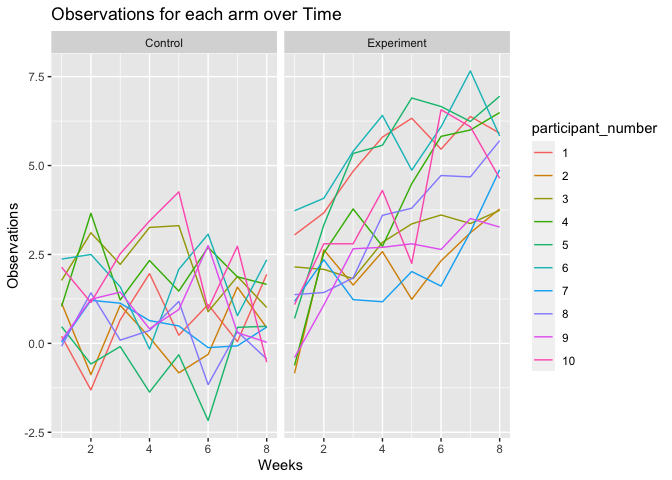

Homework 5
================
Teshawna Badu
11/20/2021

I’m an R Markdown document!

``` r
library(tidyverse)
```

    ## ── Attaching packages ─────────────────────────────────────── tidyverse 1.3.1 ──

    ## ✓ ggplot2 3.3.5     ✓ purrr   0.3.4
    ## ✓ tibble  3.1.5     ✓ dplyr   1.0.7
    ## ✓ tidyr   1.1.3     ✓ stringr 1.4.0
    ## ✓ readr   2.0.1     ✓ forcats 0.5.1

    ## ── Conflicts ────────────────────────────────────────── tidyverse_conflicts() ──
    ## x dplyr::filter() masks stats::filter()
    ## x dplyr::lag()    masks stats::lag()

``` r
library(dplyr)
library(janitor)
```

    ## 
    ## Attaching package: 'janitor'

    ## The following objects are masked from 'package:stats':
    ## 
    ##     chisq.test, fisher.test

``` r
library(readr)
library(readxl)
```

## Question 1

The problem involves using data gathered and made public by *The
Washington Post* on homicides in 50 large U.S cities.

``` r
homicide_df = 
  read_csv("./homicide-data.csv", na = c("","Unknown")) %>% 
  mutate(city_state = str_c(city, state),
         resolution = case_when(
           disposition == "Closed without arrest" ~ "unsolved",
           disposition == "Open/No arrest" ~ "unsolved",
           disposition == "Closed by arrest" ~ "solved" 
         )) %>%
  relocate(city_state) %>%
  filter(city_state != "TulsaAL")
```

    ## Rows: 52179 Columns: 12

    ## ── Column specification ────────────────────────────────────────────────────────
    ## Delimiter: ","
    ## chr (8): uid, victim_last, victim_first, victim_race, victim_sex, city, stat...
    ## dbl (4): reported_date, victim_age, lat, lon

    ## 
    ## ℹ Use `spec()` to retrieve the full column specification for this data.
    ## ℹ Specify the column types or set `show_col_types = FALSE` to quiet this message.

The raw data is has 52,179 rows of data, with 12 variables.

For city Baltimore, MD

``` r
baltimore_df = homicide_df %>%
  filter(city_state == "BaltimoreMD")
baltimore_summary = 
  baltimore_df %>%
  summarize(unsolved = sum(resolution == "unsolved"),
            n = n())
baltimore_test = 
  prop.test(x = baltimore_summary %>% pull(unsolved),
            n = baltimore_summary %>% pull(n))
baltimore_test %>%
  broom::tidy()
```

    ## # A tibble: 1 × 8
    ##   estimate statistic  p.value parameter conf.low conf.high method    alternative
    ##      <dbl>     <dbl>    <dbl>     <int>    <dbl>     <dbl> <chr>     <chr>      
    ## 1    0.646      239. 6.46e-54         1    0.628     0.663 1-sample… two.sided

Run prop.test for each of the cities in the dataset

``` r
prop_test_function = function(city_df) {
  
  city_summary = 
  city_df %>%
  summarize(unsolved = sum(resolution == "unsolved"),
            n = n())
  city_test = 
    prop.test(x = city_summary %>% pull(unsolved),
              n = city_summary %>% pull(n))
  return(city_test)
  
}
homicide_df %>%
  filter(city_state == "AlbuquerqueNM") %>%
  prop_test_function()
```

    ## 
    ##  1-sample proportions test with continuity correction
    ## 
    ## data:  city_summary %>% pull(unsolved) out of city_summary %>% pull(n), null probability 0.5
    ## X-squared = 19.114, df = 1, p-value = 1.232e-05
    ## alternative hypothesis: true p is not equal to 0.5
    ## 95 percent confidence interval:
    ##  0.3372604 0.4375766
    ## sample estimates:
    ##         p 
    ## 0.3862434

``` r
results_df = 
  homicide_df %>%
  nest(data = uid:resolution) %>%
  mutate(
    test_results = map(data, prop_test_function),
    tidy_results = map(test_results, broom::tidy)
  ) %>%
  select(city_state, tidy_results) %>%
  unnest(tidy_results) %>%
  select(city_state, estimate, starts_with("conf"))
results_df
```

    ## # A tibble: 50 × 4
    ##    city_state    estimate conf.low conf.high
    ##    <chr>            <dbl>    <dbl>     <dbl>
    ##  1 AlbuquerqueNM    0.386    0.337     0.438
    ##  2 AtlantaGA        0.383    0.353     0.415
    ##  3 BaltimoreMD      0.646    0.628     0.663
    ##  4 Baton RougeLA    0.462    0.414     0.511
    ##  5 BirminghamAL     0.434    0.399     0.469
    ##  6 BostonMA         0.505    0.465     0.545
    ##  7 BuffaloNY        0.612    0.569     0.654
    ##  8 CharlotteNC      0.300    0.266     0.336
    ##  9 ChicagoIL        0.736    0.724     0.747
    ## 10 CincinnatiOH     0.445    0.408     0.483
    ## # … with 40 more rows

create a plot showing estimates and confidence intervals

``` r
results_df %>%
  mutate(city_state = fct_reorder(city_state, estimate)) %>%
  ggplot(aes(x = city_state, y = estimate)) +
  geom_point() +
  geom_errorbar(aes(ymin = conf.low, ymax = conf.high)) +
  theme(axis.text.x = element_text(angle = 90, vjust = 0.5, hjust = 1))
```

<!-- -->

``` r
homicide_df %>%
  group_by(city_state) %>%
  summarize(
    unsolved = sum(resolution == "unsolved"),
    n = n()
  ) %>%
  mutate(
    test_results = map2(unsolved, n, prop.test),
    tidy_results = map(test_results, broom::tidy)
  ) %>%
  select(city_state, tidy_results) %>%
  unnest(tidy_results) %>%
  select(city_state, estimate, starts_with("conf"))
```

    ## # A tibble: 50 × 4
    ##    city_state    estimate conf.low conf.high
    ##    <chr>            <dbl>    <dbl>     <dbl>
    ##  1 AlbuquerqueNM    0.386    0.337     0.438
    ##  2 AtlantaGA        0.383    0.353     0.415
    ##  3 BaltimoreMD      0.646    0.628     0.663
    ##  4 Baton RougeLA    0.462    0.414     0.511
    ##  5 BirminghamAL     0.434    0.399     0.469
    ##  6 BostonMA         0.505    0.465     0.545
    ##  7 BuffaloNY        0.612    0.569     0.654
    ##  8 CharlotteNC      0.300    0.266     0.336
    ##  9 ChicagoIL        0.736    0.724     0.747
    ## 10 CincinnatiOH     0.445    0.408     0.483
    ## # … with 40 more rows

## Question 2

Create and clean dataframe

``` r
files_df <- tibble(
  files = list.files("./data")) %>%
  mutate(files = str_c("data", files, sep = "/"))
research_df <- files_df %>%
  mutate(respondents = map(files, read_csv)) %>%
  mutate(study_arm = case_when(str_detect(files, "exp") ~ "Experiment",
                               str_detect(files, "con") ~ "Control"),
         participant_number = as.factor(parse_number(files))) %>%
  unnest(respondents) %>%
  pivot_longer(cols = week_1:week_8, names_to = "week", values_to = "observations") %>%
  mutate(week = as.numeric(parse_number(week)))
```

Create spaghetti graph of observations over time split by study arm

``` r
research_df %>%
  ggplot(aes(x = week, y = observations, color = participant_number)) +
  geom_line() +
  ylab("Observations") +
  xlab("Weeks") +
  facet_grid(cols = vars(study_arm)) +
  ggtitle("Observations for each arm over Time ")
```

<!-- -->

For the spaghetti plot, we see that participants in the control arm
report similar observations over time. In contrast, participants in the
experimental arm report different observations over time.

## Question 3

``` r
set.seed(10)
iris_with_missing = iris %>% 
  map_df(~replace(.x, sample(1:150, 20), NA)) %>%
  mutate(Species = as.character(Species))
```

Writing function & Testing

``` r
iris_missing_function = function(x) {
  if (is_numeric(x)) {
    mean_nonmissing = round(mean(x, na.rm = TRUE, 1))
    x = replace_na(x, mean_nonmissing)}
  else if (is.character(x)) {
    x = replace_na(x, "virginica")}
  return(x)
}
iris_fillin = 
  map_df(iris_with_missing, iris_missing_function) %>% 
  as.tibble()
```

    ## Warning: `as.tibble()` was deprecated in tibble 2.0.0.
    ## Please use `as_tibble()` instead.
    ## The signature and semantics have changed, see `?as_tibble`.
    ## This warning is displayed once every 8 hours.
    ## Call `lifecycle::last_lifecycle_warnings()` to see where this warning was generated.

    ## Warning: Deprecated

    ## Warning: Deprecated

    ## Warning: Deprecated

    ## Warning: Deprecated

    ## Warning: Deprecated

``` r
knitr::kable(iris_fillin)
```

| Sepal.Length | Sepal.Width | Petal.Length | Petal.Width | Species    |
|-------------:|------------:|-------------:|------------:|:-----------|
|          5.1 |         3.5 |          1.4 |         0.2 | setosa     |
|          4.9 |         3.0 |          1.4 |         0.2 | setosa     |
|          4.7 |         3.2 |          1.3 |         0.2 | setosa     |
|          4.6 |         3.1 |          1.5 |         1.0 | setosa     |
|          5.0 |         3.6 |          1.4 |         0.2 | setosa     |
|          5.4 |         3.9 |          1.7 |         0.4 | setosa     |
|          6.0 |         3.4 |          1.4 |         0.3 | setosa     |
|          5.0 |         3.4 |          1.5 |         0.2 | setosa     |
|          4.4 |         2.9 |          1.4 |         0.2 | setosa     |
|          4.9 |         3.1 |          4.0 |         0.1 | setosa     |
|          5.4 |         3.0 |          1.5 |         0.2 | setosa     |
|          4.8 |         3.4 |          1.6 |         0.2 | setosa     |
|          6.0 |         3.0 |          1.4 |         0.1 | setosa     |
|          4.3 |         3.0 |          4.0 |         0.1 | setosa     |
|          6.0 |         4.0 |          4.0 |         0.2 | setosa     |
|          5.7 |         4.4 |          1.5 |         0.4 | setosa     |
|          5.4 |         3.9 |          1.3 |         0.4 | setosa     |
|          5.1 |         3.5 |          1.4 |         1.0 | setosa     |
|          5.7 |         3.8 |          1.7 |         0.3 | setosa     |
|          5.1 |         3.8 |          1.5 |         1.0 | setosa     |
|          5.4 |         3.4 |          1.7 |         0.2 | setosa     |
|          5.1 |         3.7 |          1.5 |         0.4 | virginica  |
|          4.6 |         3.6 |          1.0 |         0.2 | setosa     |
|          6.0 |         3.3 |          4.0 |         0.5 | setosa     |
|          4.8 |         3.4 |          1.9 |         0.2 | virginica  |
|          5.0 |         3.0 |          4.0 |         0.2 | setosa     |
|          5.0 |         3.4 |          1.6 |         0.4 | virginica  |
|          5.2 |         3.5 |          1.5 |         0.2 | setosa     |
|          6.0 |         3.4 |          1.4 |         0.2 | setosa     |
|          4.7 |         3.2 |          1.6 |         0.2 | setosa     |
|          4.8 |         3.1 |          4.0 |         0.2 | setosa     |
|          5.4 |         3.0 |          1.5 |         0.4 | setosa     |
|          5.2 |         3.0 |          1.5 |         0.1 | setosa     |
|          5.5 |         4.2 |          1.4 |         0.2 | setosa     |
|          4.9 |         3.1 |          4.0 |         0.2 | setosa     |
|          5.0 |         3.2 |          1.2 |         0.2 | setosa     |
|          5.5 |         3.5 |          1.3 |         0.2 | setosa     |
|          4.9 |         3.6 |          1.4 |         0.1 | setosa     |
|          4.4 |         3.0 |          1.3 |         1.0 | setosa     |
|          5.1 |         3.4 |          1.5 |         0.2 | setosa     |
|          5.0 |         3.5 |          1.3 |         0.3 | setosa     |
|          4.5 |         3.0 |          1.3 |         1.0 | virginica  |
|          4.4 |         3.2 |          1.3 |         0.2 | setosa     |
|          5.0 |         3.5 |          1.6 |         0.6 | setosa     |
|          5.1 |         3.8 |          1.9 |         0.4 | setosa     |
|          4.8 |         3.0 |          1.4 |         0.3 | virginica  |
|          5.1 |         3.8 |          1.6 |         0.2 | setosa     |
|          4.6 |         3.2 |          4.0 |         0.2 | setosa     |
|          5.3 |         3.7 |          1.5 |         0.2 | setosa     |
|          5.0 |         3.0 |          1.4 |         0.2 | setosa     |
|          7.0 |         3.0 |          4.7 |         1.4 | virginica  |
|          6.4 |         3.2 |          4.5 |         1.5 | versicolor |
|          6.9 |         3.1 |          4.9 |         1.5 | versicolor |
|          5.5 |         2.3 |          4.0 |         1.3 | versicolor |
|          6.5 |         2.8 |          4.6 |         1.5 | versicolor |
|          5.7 |         2.8 |          4.5 |         1.3 | versicolor |
|          6.3 |         3.3 |          4.7 |         1.6 | virginica  |
|          4.9 |         2.4 |          4.0 |         1.0 | versicolor |
|          6.6 |         2.9 |          4.6 |         1.3 | virginica  |
|          5.2 |         2.7 |          3.9 |         1.4 | versicolor |
|          5.0 |         2.0 |          4.0 |         1.0 | versicolor |
|          5.9 |         3.0 |          4.2 |         1.5 | versicolor |
|          6.0 |         2.2 |          4.0 |         1.0 | versicolor |
|          6.1 |         2.9 |          4.7 |         1.4 | versicolor |
|          5.6 |         2.9 |          3.6 |         1.3 | versicolor |
|          6.7 |         3.1 |          4.4 |         1.4 | versicolor |
|          5.6 |         3.0 |          4.5 |         1.5 | versicolor |
|          5.8 |         3.0 |          4.1 |         1.0 | versicolor |
|          6.2 |         2.2 |          4.5 |         1.5 | versicolor |
|          5.6 |         2.5 |          3.9 |         1.1 | versicolor |
|          5.9 |         3.2 |          4.8 |         1.8 | versicolor |
|          6.0 |         2.8 |          4.0 |         1.3 | virginica  |
|          6.3 |         2.5 |          4.9 |         1.5 | versicolor |
|          6.0 |         2.8 |          4.0 |         1.2 | versicolor |
|          6.4 |         2.9 |          4.3 |         1.3 | versicolor |
|          6.6 |         3.0 |          4.4 |         1.4 | versicolor |
|          6.8 |         2.8 |          4.8 |         1.4 | versicolor |
|          6.7 |         3.0 |          5.0 |         1.0 | versicolor |
|          6.0 |         3.0 |          4.5 |         1.0 | versicolor |
|          5.7 |         2.6 |          3.5 |         1.0 | virginica  |
|          5.5 |         2.4 |          3.8 |         1.1 | versicolor |
|          6.0 |         2.4 |          3.7 |         1.0 | versicolor |
|          5.8 |         2.7 |          3.9 |         1.2 | versicolor |
|          6.0 |         2.7 |          5.1 |         1.6 | versicolor |
|          5.4 |         3.0 |          4.5 |         1.5 | versicolor |
|          6.0 |         3.4 |          4.5 |         1.6 | versicolor |
|          6.7 |         3.1 |          4.7 |         1.0 | versicolor |
|          6.0 |         3.0 |          4.4 |         1.3 | versicolor |
|          5.6 |         3.0 |          4.0 |         1.0 | versicolor |
|          5.5 |         2.5 |          4.0 |         1.0 | versicolor |
|          5.5 |         3.0 |          4.4 |         1.2 | versicolor |
|          6.0 |         3.0 |          4.6 |         1.0 | versicolor |
|          5.8 |         3.0 |          4.0 |         1.0 | versicolor |
|          5.0 |         2.3 |          3.3 |         1.0 | virginica  |
|          6.0 |         2.7 |          4.2 |         1.3 | versicolor |
|          5.7 |         3.0 |          4.2 |         1.2 | versicolor |
|          5.7 |         2.9 |          4.2 |         1.3 | versicolor |
|          6.2 |         2.9 |          4.3 |         1.3 | versicolor |
|          5.1 |         2.5 |          3.0 |         1.0 | versicolor |
|          5.7 |         2.8 |          4.1 |         1.3 | virginica  |
|          6.3 |         3.0 |          4.0 |         2.5 | virginica  |
|          5.8 |         2.7 |          5.1 |         1.9 | virginica  |
|          7.1 |         3.0 |          5.9 |         2.1 | virginica  |
|          6.3 |         2.9 |          5.6 |         1.8 | virginica  |
|          6.5 |         3.0 |          5.8 |         2.2 | virginica  |
|          7.6 |         3.0 |          6.6 |         2.1 | virginica  |
|          4.9 |         2.5 |          4.5 |         1.7 | virginica  |
|          7.3 |         2.9 |          6.3 |         1.8 | virginica  |
|          6.7 |         3.0 |          4.0 |         1.8 | virginica  |
|          6.0 |         3.6 |          4.0 |         2.5 | virginica  |
|          6.5 |         3.2 |          5.1 |         2.0 | virginica  |
|          6.0 |         2.7 |          5.3 |         1.9 | virginica  |
|          6.8 |         3.0 |          5.5 |         2.1 | virginica  |
|          5.7 |         3.0 |          5.0 |         2.0 | virginica  |
|          5.8 |         2.8 |          5.1 |         2.4 | virginica  |
|          6.4 |         3.2 |          5.3 |         2.3 | virginica  |
|          6.5 |         3.0 |          4.0 |         1.8 | virginica  |
|          7.7 |         3.8 |          6.7 |         1.0 | virginica  |
|          7.7 |         2.6 |          6.9 |         2.3 | virginica  |
|          6.0 |         2.2 |          5.0 |         1.5 | virginica  |
|          6.0 |         3.2 |          5.7 |         1.0 | virginica  |
|          5.6 |         3.0 |          4.9 |         2.0 | virginica  |
|          7.7 |         2.8 |          6.7 |         2.0 | virginica  |
|          6.3 |         2.7 |          4.9 |         1.8 | virginica  |
|          6.7 |         3.3 |          5.7 |         2.1 | virginica  |
|          7.2 |         3.2 |          6.0 |         1.8 | virginica  |
|          6.2 |         2.8 |          4.8 |         1.8 | virginica  |
|          6.1 |         3.0 |          4.9 |         1.8 | virginica  |
|          6.4 |         2.8 |          5.6 |         2.1 | virginica  |
|          7.2 |         3.0 |          5.8 |         1.6 | virginica  |
|          7.4 |         2.8 |          6.1 |         1.0 | virginica  |
|          7.9 |         3.8 |          4.0 |         2.0 | virginica  |
|          6.4 |         2.8 |          4.0 |         2.2 | virginica  |
|          6.0 |         2.8 |          5.1 |         1.5 | virginica  |
|          6.1 |         3.0 |          5.6 |         1.4 | virginica  |
|          6.0 |         3.0 |          6.1 |         2.3 | virginica  |
|          6.0 |         3.4 |          5.6 |         1.0 | virginica  |
|          6.4 |         3.1 |          5.5 |         1.0 | virginica  |
|          6.0 |         3.0 |          4.8 |         1.8 | virginica  |
|          6.9 |         3.1 |          5.4 |         2.1 | virginica  |
|          6.7 |         3.1 |          5.6 |         2.4 | virginica  |
|          6.9 |         3.1 |          5.1 |         2.3 | virginica  |
|          6.0 |         2.7 |          5.1 |         1.9 | virginica  |
|          6.8 |         3.2 |          4.0 |         2.3 | virginica  |
|          6.7 |         3.3 |          4.0 |         2.5 | virginica  |
|          6.7 |         3.0 |          5.2 |         2.3 | virginica  |
|          6.3 |         2.5 |          5.0 |         1.9 | virginica  |
|          6.5 |         3.0 |          5.2 |         2.0 | virginica  |
|          6.0 |         3.4 |          5.4 |         2.3 | virginica  |
|          5.9 |         3.0 |          5.1 |         1.8 | virginica  |

``` r
view(iris_fillin)
```
